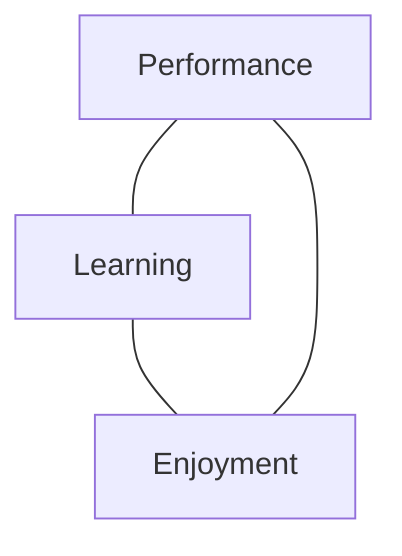
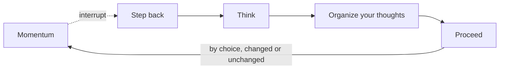
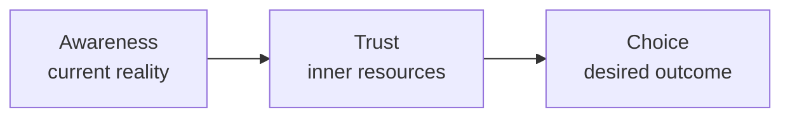

# The Inner Game of Work

Timothy Gallwey, 2000, subtitled *Focus, Learning, Pleasure, and Mobility in
the Workplace*, with a preface by Peter Block. Gallwey coached tennis, noticed
that his students improved faster when he stopped instructing them, and spent
the rest of his career moving that observation off the court. This is the
fourth of the Inner Game books and the one aimed squarely at work.

The tool most people come here for is STOP, and it is Chapter 7 of ten. The
rest of the book is what makes it more than a slogan, so it is worth knowing
what surrounds it.

## What the Book Argues

There are two games running at once. The **outer game** is the visible one:
the ball, the deadline, the deliverable. The **inner game** is played against
obstacles you supply yourself: fear of failure, resistance to change,
procrastination, stagnation, doubt, boredom. Gallwey's claim is that most
people are already capable of the work in front of them, and that what degrades
their performance is not a missing skill but self-generated interference.

He writes it as a formula: **P = p − i**. Performance equals potential minus
interference. Conventional training and instruction address the first term.
Gallwey argues the second is usually the larger one and is almost never worked
on directly.

The interference has a name. **Self 1** is the commentator: the voice that
instructs, judges, anticipates being judged, and narrates how the work is going
while the work is happening. **Self 2** is the part that actually does the
thing, and it is competent. Self 1 issues vague and over-simple instructions
while Self 2 is executing something far more complex, and then takes none of
the blame when the result is poor. Self 1 is largely assembled out of
internalised voices from outside, which is why the book's central movement is
away from conformity.

His remedy is not positive thinking, which he treats as more Self 1 noise. It
is **non-judgmental awareness**. The first step toward change is accepting
things as they are without grading them, because accurate observation changes
behaviour on its own, and faster than being told what to do.

The book's own summary of the whole apparatus is a triad: **awareness, choice
and trust**. Awareness is a clear picture of the current situation; choice is
movement in a desired direction; trust in your own inner resources is what
allows the movement to happen. Gallwey treats these as three parts of one
thing, not a sequence.

## Chapters

| | |
|---|---|
| Intro | The Quest to Work Free |
| 1 | A Better Way to Change |
| 2 | The Inner Game Meets Corporate America |
| 3 | Focus of Attention |
| 4 | The Practice of Focus |
| 5 | Redefining Work |
| 6 | From Conformity to Mobility |
| 7 | **The STOP Tool** |
| 8 | Think Like a CEO |
| 9 | Coaching |
| 10 | The Inherent Ambition |

## A Better Way to Change

Chapter 1's argument is that resistance to change is usually resistance to the
*process* of change rather than to the change itself. People object to being
changed, not to being different.

He is pointed about who this applies to. The people empowered to make change
routinely exempt themselves from it: change is what "we" do to "them". That
line does more work than most of the change-management literature it sits
against.

## Focus of Attention and Critical Variables

Chapters 3 and 4 are the practical core, and they are where the tennis
technique actually transfers. Gallwey's claim is that there is no more
important general skill for learning and for good results than focus of
attention.

The mechanism is the **critical variable**: pick something specific and
observable in the work, and attend to it closely without judging it, often
rating it on a scale of 1 to 10. In sport the critical variables tend to be
physical; at work they are often mental. Crucially, he says not to agonise over
choosing the *right* variable. Focusing on almost any real variable will put
you in a state of non-judgmental awareness, and that state is what produces the
change.

The origin story is his first corporate engagement, at AT&T, where he was asked
to improve the courtesy of customer service operators on the condition that he
never use the word "courtesy". He made the customer's voice into the tennis
ball: operators identified its tone, noticed the tone in their own voices, and
rated the qualities from 1 to 10. Attention to the variable did what the
instruction could not.

He also names the conditions under which Self 2 focus appears: **enough safety
and enough challenge**. Too little of either and attention does not settle.

## Redefining Work: The Work Triangle

Chapter 5 argues that work pays in three currencies, not one. The **work
triangle** is **Performance, Learning and Enjoyment**, and Gallwey's specific
framing is that all three are forms of *compensation*. From Self 2's point of
view, the learning and the enjoyment are part of what you are paid, not
side-effects of being paid.

His practical point is that learning is a real component of work rather than an
accidental by-product, and that the usual objection to it, no time, misreads
where it happens. Learning from experience runs at the same time as the work,
so it costs very little extra. The chapter engages directly with Drucker's
knowledge worker.

Most workplaces measure only the first corner. Gallwey's argument is that a job
optimised for performance alone eventually degrades performance too.

## From Conformity to Mobility

Chapter 6 carries the book's central dichotomy, and the publisher's own framing
of the whole book is this: stop working in **conformity mode** and start
working in **mobility mode**.

Conformity is doing the work in the shape someone else's expectations gave it,
usually without having noticed that this happened. Mobility is not simply the
ability to change; Gallwey's sense includes knowing where you are going, being
willing to make changes within a change, keeping your purpose clear, and
staying in some harmony with your own progress. Movement is not the test.
Not all movement is mobility.

## The STOP Tool

Chapter 7. STOP is the practical instrument for interrupting momentum so that
what happens next is chosen rather than carried:

- **S**tep back
- **T**hink
- **O**rganize your thoughts
- **P**roceed

Gallwey describes the step-back as lifting your head out of the stream of
rushing events and asking what you actually want out of this day, this hour, or
this minute. The standard questions for the Think step are: what am I trying to
accomplish, what is my priority here, and do I need to change what I am doing
or how I am doing it. He suggests writing your own list of such questions and
keeping it where you can reach it.

**It has no fixed length.** The four steps can take two seconds, two hours or
two days. Two seconds before answering the phone or before speaking, or as you
feel anger or hurt arriving. Longer ones for reflection at either end of a day,
or for weighing options. Long ones for a strategic look at the whole picture.

**Occasions he suggests for a STOP:**

- before you speak;
- at the beginning and at the end of each working day;
- at the beginning and end of any project;
- once or twice during the day, to check how you are doing against the
  priorities you set that morning;
- to make a conscious change;
- to address a mistake;
- to correct a miscommunication;
- to learn, or to coach; and
- to rest.

The last one gets its own argument. Stress is not the only signal that a STOP
for rest is due; another is the feeling that the work no longer gives any
pleasure, when the next project reads as a burden rather than an opportunity,
and when *ought* has beaten *want*. This connects to a longer passage in the
book on workplace pressure overriding the body's own signals to rest.

The obvious objection to STOP is that there is no time for it, and Gallwey's
position is that the absence of time is precisely the condition under which it
is most needed. Sometimes, to accelerate, you have to slow down and stop.

## Think Like a CEO

Chapter 8 asks you to treat yourself as the chief executive of your own
enterprise: take stock of what you hold, and define your own mission and
product rather than inheriting one. It is the conformity argument applied to a
career instead of a task.

## Coaching

Chapter 9 contains Gallwey's most-quoted single sentence: coaching is the art
of creating an environment, through conversation and a way of being, that
makes it easier for a person to move toward what they want.

Inner Game coaching divides into three conversations, matching the triad:

- the **awareness** conversation, the clearest possible picture of current
  reality;
- the **choice** conversation, the clearest possible picture of the desired
  outcome; and
- the **trust** conversation, giving the person better access to their own
  inner and outer resources so they can move between the two.

Two consequences he draws. Coaching is a dance in which the learner leads, not
the coach. And the value of a coach lies in their *not* being you and therefore
seeing things differently, which is also why he holds that in sport he had to
learn to teach less so that more could be learned, and that the same is true in
business. The chapter closes with a demonstration of coaching someone in a
skill the coach knows nothing about.

## The Inherent Ambition

Chapter 10 is written as a dialogue between Gallwey and an inner voice, and it
is where the "work free" idea from the introduction lands: work for yourself
rather than for the outer demands, and the purpose is yours. It is the least
instrumental part of the book and the part readers either take as the point or
skip entirely.

## Review Questions

- Is the obstacle here actually a missing skill, or is it interference?
- Which critical variable could I attend to, and could I put a number on it?
- Am I doing this in the shape I chose, or the shape expectations gave it?
- Of performance, learning and enjoyment, which is this work paying me in?
- When did I last choose this direction, as opposed to continue in it?
- If there is no time to stop, what is that telling me?
- Am I instructing where I should be helping someone see?
